<div align="center">
  <h1>grasp-fusion</h1>
  <h3>GraspFusion: Realizing Complex Motion by Learning and Fusing Grasp Modalities with Instance Segmentation (ICRA2019)</h3>
  <h4>Shun Hasegawa*, Kentaro Wada*, Shingo Kitagawa, Yuto Uchimi, Kei Okada, Masayuki Inaba <small>(* equal contribution)</small></h4>
  <p>
    <a href="https://drive.google.com/uc?id=16FVgGONJbvuSdvevHbZ0Ac7Wa8w82UzC">Paper</a>
    |
    <a href="https://drive.google.com/uc?id=1J40NPD-WDmMKbZps-JYTmVQuptCLRA4C">Video</a>
    |
    <a href="https://drive.google.com/uc?id=1Vx4Oa-aNOjrK37CM5dbHdDITRVj_766z">Poster</a>
    |
    <a href="https://github.com/wkentaro/grasp-fusion">Code</a>
  </p>
  <a href="https://drive.google.com/uc?id=1J40NPD-WDmMKbZps-JYTmVQuptCLRA4C">
    
  </a>
</div>


## Installation

### Recommended

1. [Install whole jsk_apc](https://github.com/start-jsk/jsk_apc/tree/master#installation)
2. `catkin build grasp_fusion` just in case

### Minimum (Some features may not work)

#### For Examples

```bash
# create catkin workspace
mkdir -p ~/catkin_ws/src
cd ~/catkin_ws
git clone https://github.com/start-jsk/jsk_apc.git
cd src

rosdep install --from-path . -i -y -r
sudo -H pip install cupy-cuda101  # CUDA10.1, cupy-cuda92 for 9.2

cd ~/catkin_ws
source /opt/ros/kinetic/setup.zsh
catkin build grasp_fusion --no-deps
```

#### For Full Demonstration

```bash
# create catkin workspace
mkdir -p ~/catkin_ws/src
cd ~/catkin_ws
git clone https://github.com/start-jsk/jsk_apc.git
cd src

wstool init
cat jsk_apc/.travis.rosinstall >> .rosinstall
cat jsk_apc/.travis.rosinstall.kinetic >> .rosinstall
wstool update -j -1

rosdep install --from-path . -i -y -r
sudo -H pip install cupy-cuda101  # CUDA10.1, cupy-cuda92 for 9.2

cd ~/catkin_ws
source /opt/ros/kinetic/setup.zsh
catkin build grasp_fusion
```

## Examples

### Without ROS

```bash
# item data (originally provided at Amazon Picking Challenge)
cd examples/grasp_fusion/instance_segmentation
./view_item_data_all.py
```
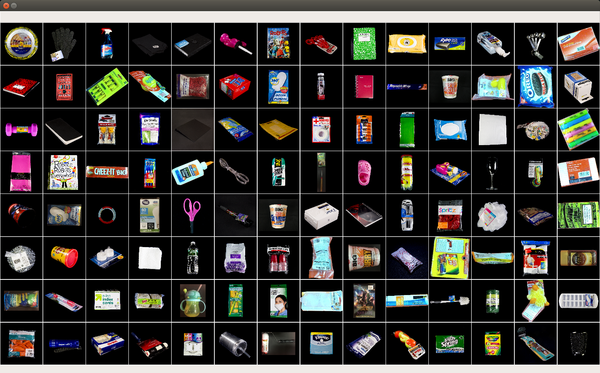

```bash
# training data (synthetic), testing data (real)
cd examples/grasp_fusion/instance_segmentation
./view_dataset.py --split train
./view_dataset.py --split test
```
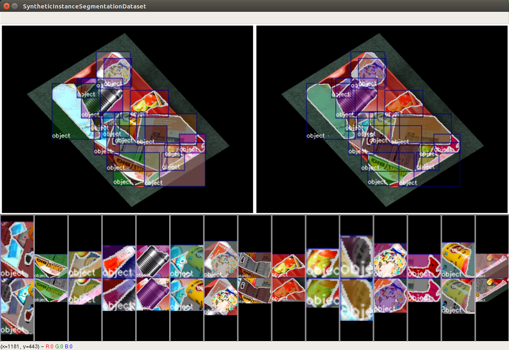 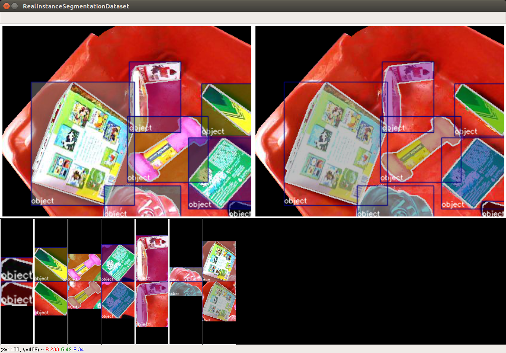

```bash
# object-class-agnostic instance segmentation with Mask R-CNN
cd examples/grasp_fusion/instance_segmentation
./train.py --gpu 0
```
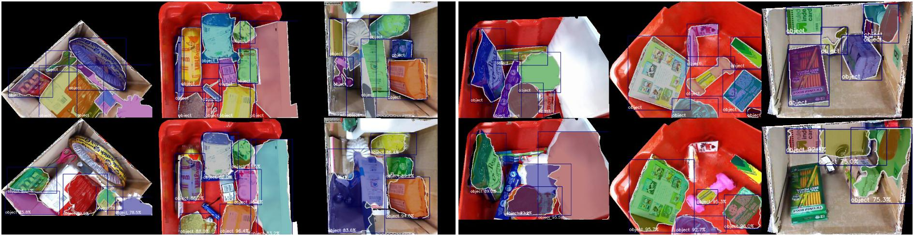<br/><i>Figure: Visualization on Test Data (Top: ground truth, Bottom: prediction)</i>

- Full log: https://drive.google.com/open?id=1LLYXlhqyliHJnJmN_BzN7HTTHFUiYqhL
- Model file: https://drive.google.com/uc?id=1rsXuIL-CAhBAzsJvZ2ZbGrbIOhb2dTGk

```bash
cd examples/grasp_fusion/affordance_segmentation
./get_heightmaps.py
./view_pinch_dataset.py
./view_suction_dataset.py
```
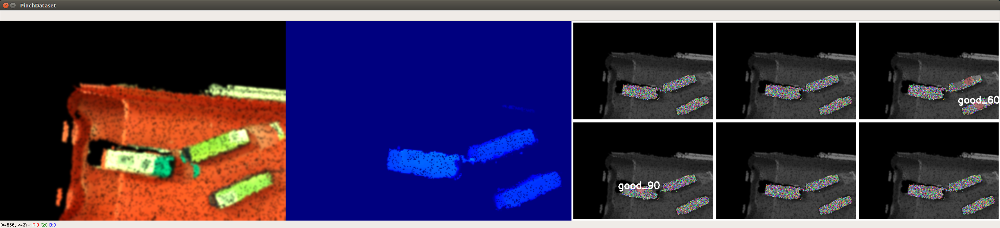 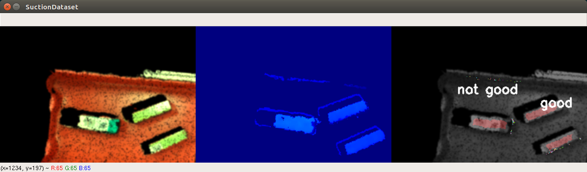

```bash
cd examples/grasp_fusion/affordance_segmentation
./train.py pinch --modal rgb+depth --resolution 15 --gpu 0
```
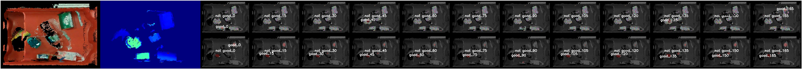<br/><i>Figure: Visualization on Test Data (Top: ground truth, Bottom: prediction)</i>

- Full log: https://drive.google.com/open?id=1wwUwEirUZITgpehvSYsnVj3uBiF8qiyp
- Model file: https://drive.google.com/uc?id=16NNJHVGja4NEW1LYRDYedJ0baqR6JXyZ

```bash
cd examples/grasp_fusion/affordance_segmentation
./train.py suction --modal rgb+depth --gpu 0
```
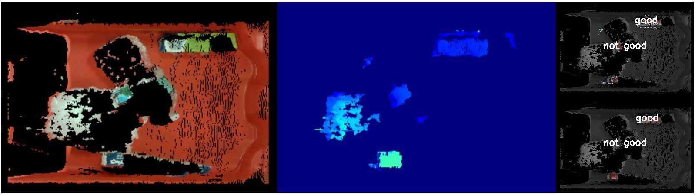<br/><i>Figure: Visualization on Test Data (Top: ground truth, Bottom: prediction)</i>

- Full log: https://drive.google.com/open?id=1z39gPIf_yXUnc1Dwpt4IvbZc_tmLUPtm
- Model file: https://drive.google.com/uc?id=1wTrWCPP2IuPzk06XQzn9oLJKk9iS1H7O

```bash
cd examples/grasp_fusion/primitive_matching
./get_primitives_poses.py
```
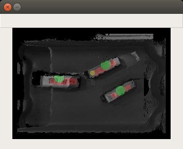<br/><i>Figure: Visualization of Primitives (Red: suction, Green: pinch, Yellow: parallel-graspfusion)</i>


### With ROS

```bash
roslaunch grasp_fusion sample_instance_segmentation.launch
```
<br/><i>Figure: Predicted Instance Masks</i>

```bash
roslaunch grasp_fusion sample_affordance_segmentation.launch affordance:=pinch
```
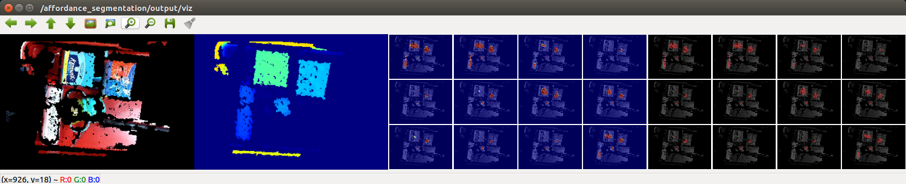<br/><i>Figure: Predicted Pinch Points</i>

```bash
roslaunch grasp_fusion sample_affordance_segmentation.launch affordance:=suction
```
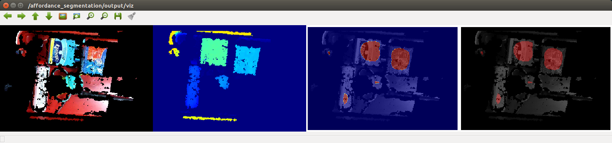<br/><i>Figure: Predicted Suction Points</i>

```bash
roslaunch grasp_fusion sample_sole_affordance_segmentation.launch
```
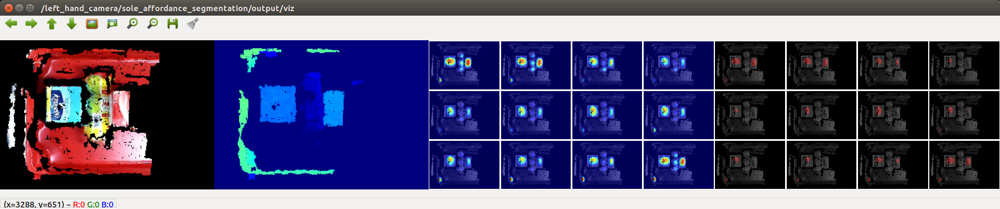<br/><i>Figure: Predicted Pinch Points Ignoring Inter-Object Relationship</i>

```bash
roslaunch grasp_fusion sample_primitive_matching.launch
```
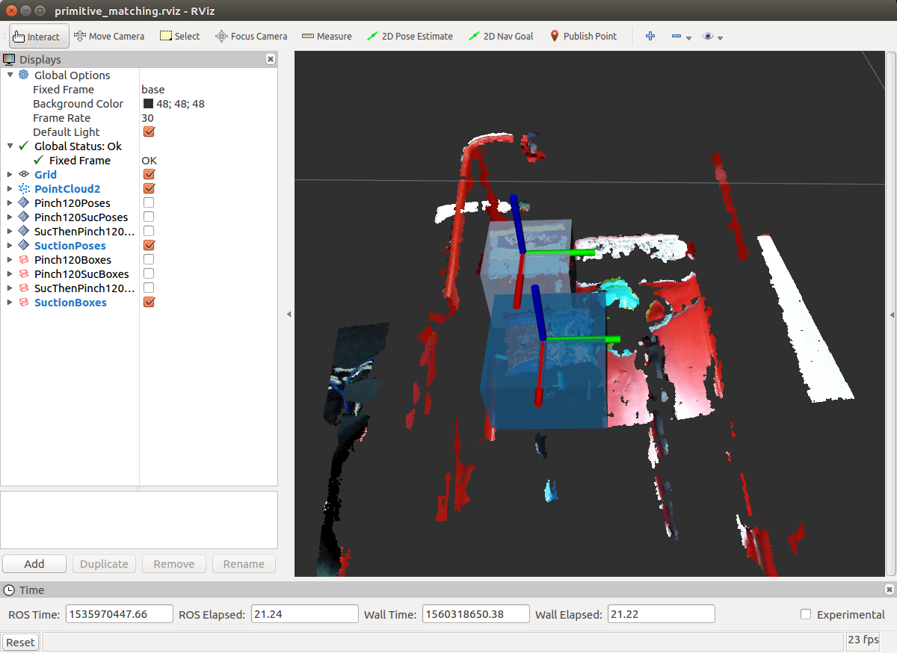<br/><i>Figure: 3D Suction Points Predicted</i>

```bash
# Holistic Integration for Demonstration
roslaunch grasp_fusion baxter.launch
roslaunch grasp_fusion setup_for_stow.launch
roslaunch grasp_fusion stow.launch
```

```bash
# Experiments of Grasp Stability
roslaunch grasp_fusion baxter.launch
roslaunch grasp_fusion setup_for_stow.launch
roslaunch grasp_fusion stow.launch main:=false
roseus `rospack find grasp_fusion`/euslisp/eval-picking.l

# in Euslisp interpreter
(eval-picking-init :ctype :larm-head-controller :moveit t)
(eval-picking-mainloop :larm)
## Please see warn messages and source codes for optional settings
```


## Citation

```
@inproceedings{Hasegawa:etal:ICRA2019,
  title={{GraspFusion}: Realizing Complex Motion by Learning and Fusing Grasp Modalities with Instance Segmentation},
  author={Shun Hasegawa, Kentaro Wada, Shingo Kitagawa, Yuto Uchimi, Kei Okada, Masayuki Inaba},
  booktitle={{Proceedings of the IEEE International Conference on Robotics and Automation (ICRA)}},
  year={2019},
}
```

## Advanced Usage (At Your Own Risk)

### Installation

```bash
make install  # Python3
# make install2  # Python2
```

### Usage

```bash
source .anaconda/bin/activate
python -c 'import grasp_fusion_lib'
```

### Testing

```bash
make lint
make test
```
