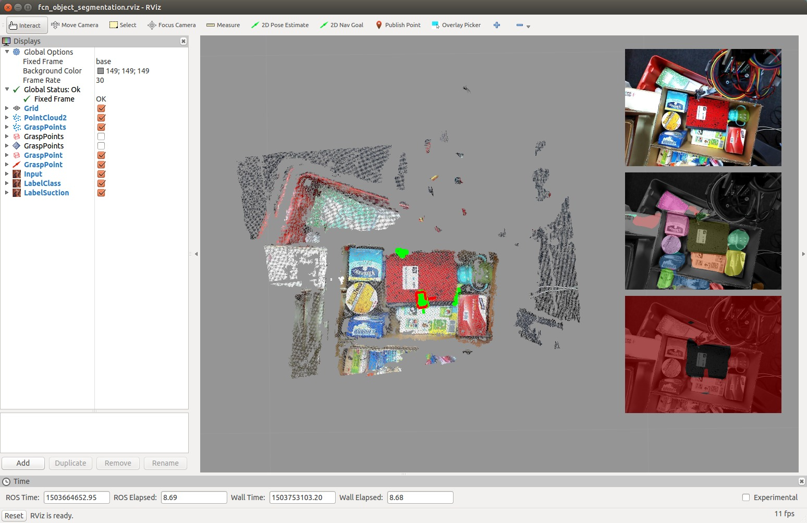

# grasp_prediction_arc2017


## Installation

### With ROS

[Install jsk_apc](https://github.com/start-jsk/jsk_apc#installation).

### (At Your Own Risk) Without ROS (Use Anaconda)

```bash
make install  # Python3
# make install2  # Python2
```

##### Usage

```bash
source .anaconda/bin/activate
python -c 'import grasp_prediction_arc2017_lib'
```

##### Testing

```bash
make lint
```


## Examples

### Without ROS

First, you must activate python environment:
```bash
source ~/ros/ws_jsk_apc/devel/.private/grasp_prediction_arc2017/share/grasp_prediction_arc2017/venv/bin/activate
# If you want to use Anaconda environment:
# source .anaconda/bin/activate
```

##### Training CNNs

###### Requirements

- cupy
  ```bash
  pip install cupy-cuda92  # or cupy, cupy-cuda80, cupy-cuda90, ...
  ```

###### Object label and grasp affordance segmentation with ARC2017 dataset

```bash
cd examples/grasp_prediction_arc2017
./train_fcn32s.py -g 0 -d -p wada_icra2018
```

###### Object label and grasp affordance segmentation with book dataset

```bash
cd examples/grasp_prediction_arc2017
./train_fcn8s.py -g 0 -d -p hasegawa_iros2018  # or hasegawa_mthesis
```


### With ROS

```bash
roslaunch grasp_prediction_arc2017 sample_fcn_object_segmentation.launch
```



## ARC2017 demonstration

```bash
roslaunch jsk_arc2017_baxter baxter.launch
roslaunch grasp_prediction_arc2017 setup_for_pick.launch
roslaunch jsk_arc2017_baxter pick.launch json_dir:=<json_dir>
```


## Hasegawa IROS2018 Demo: Pick and Insert Books

### Setup

```bash
rosrun grasp_prediction_arc2017 install_hasegawa_iros2018
```

### Execution

```bash
roslaunch grasp_prediction_arc2017 baxterlgv7.launch
roslaunch grasp_prediction_arc2017 setup_for_book_picking.launch hasegawa_iros2018:=true
roslaunch grasp_prediction_arc2017 book_picking.launch json_dir:=`rospack find grasp_prediction_arc2017`/json_dirs/hasegawa_iros2018/ForItemDataBooks6/layout1
```


## Hasegawa Master Thesis Demo: Grasp Books with Low Lifting

### Setup

```bash
rosrun grasp_prediction_arc2017 install_hasegawa_mthesis
```

### Execution

```bash
# Experiments of Grasp Stability
roslaunch grasp_prediction_arc2017 baxterlgv7.launch
roslaunch grasp_prediction_arc2017 setup_for_book_picking.launch hasegawa_mthesis:=true
roslaunch grasp_prediction_arc2017 book_picking.launch main:=false json_dir:=`rospack find grasp_prediction_arc2017`/json_dirs/hasegawa_mthesis/ForItemDataBooks8/each_obj/alpha_cubic_sport_wallet
roseus `rospack find grasp_prediction_arc2017`/euslisp/hasegawa_mthesis/pick-book-eval.l

# In Euslisp Interpreter
(pick-book-eval-init :ctype :larm-head-controller :moveit t)
(pick-book-eval-mainloop :larm)
## Please see warn messages and source codes for optional settings
```
