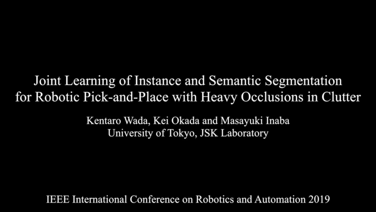
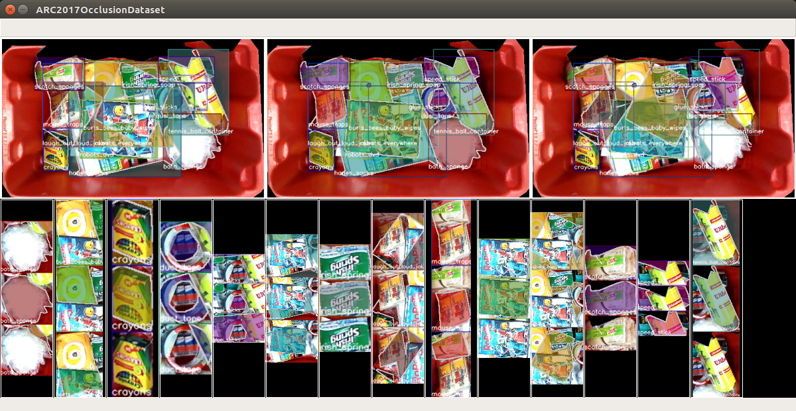
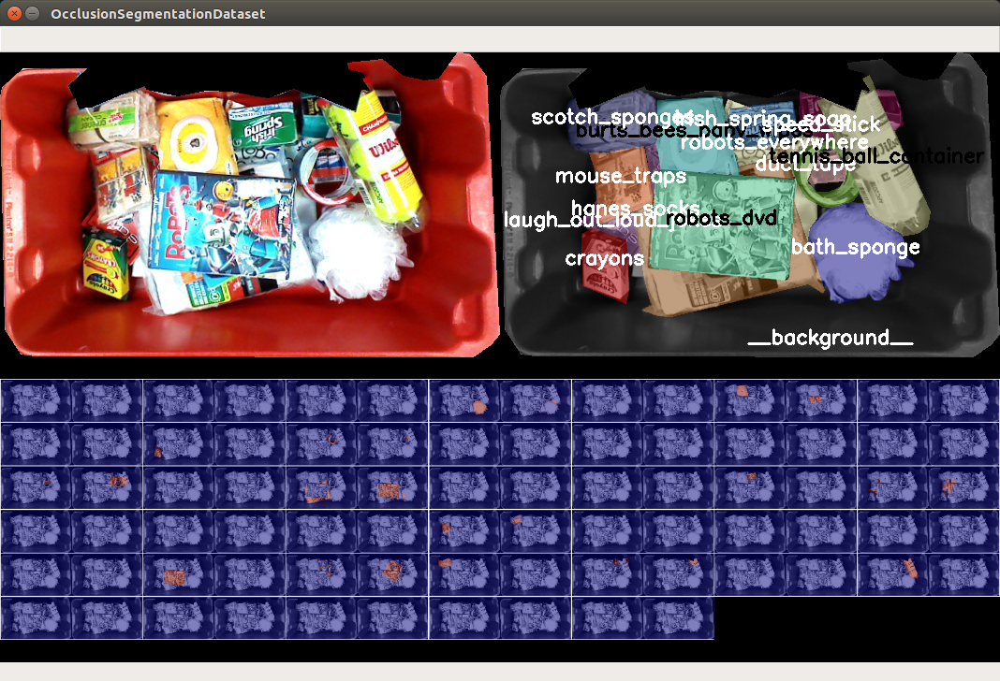
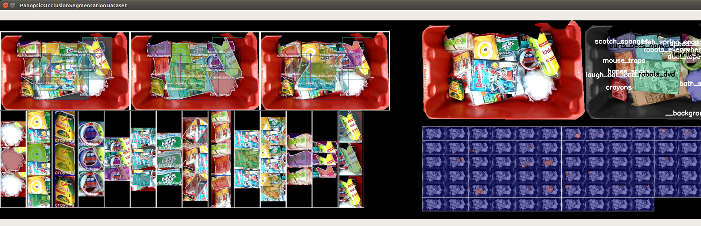
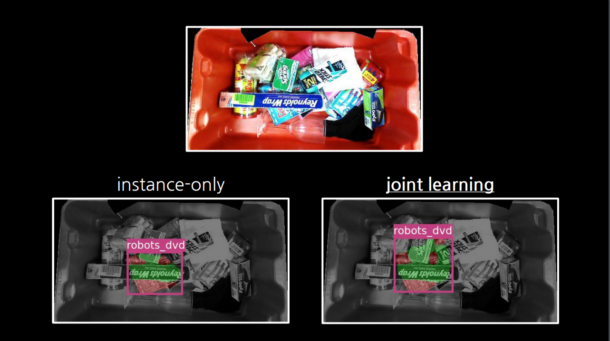
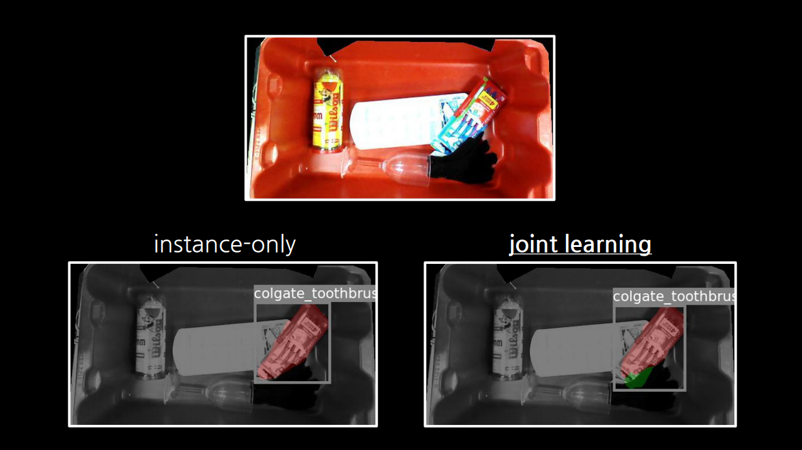
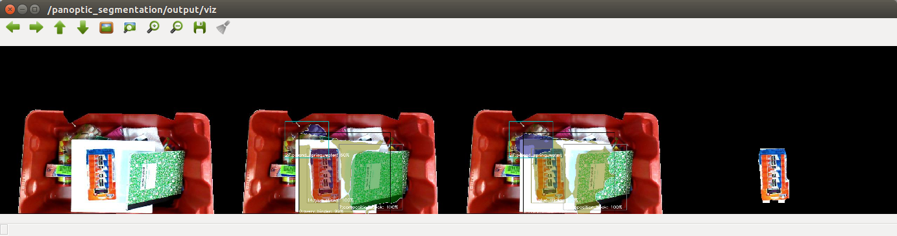

<div align="center">
  <h1>instance-occlsegm</h1>
  <h3>Joint Learning of Instance and Semantic Segmentation for Robotic Pick-and-Place with Heavy Occlusions in Clutter (ICRA2019)</h3>
  <h4>Kentaro Wada, Kei Okada, Masayuki Inaba</h4>
  <p>
    <a href="https://drive.google.com/uc?id=1ynlSG7ccmPWkV1mXvtMsY7EB9hIe_83-">Paper</a>
    |
    <a href="https://www.youtube.com/watch?v=bRTI0whWkq8">Video</a>
    |
    <a href="https://drive.google.com/uc?id=1Vq_zMNzx7pJX9X4fTSg8I_TvTcuNnnVB">Poster</a>
    |
    <a href="https://drive.google.com/uc?id=1WPfzFz6F7RGPuBzV9zIECNbUissyQPqU">Supplimentary</a>
  </p>
  <a href="https://www.youtube.com/watch?v=bRTI0whWkq8">
    
  </a>
</div>


## Installation

### For Examples

```bash
# create catkin workspace
mkdir -p ~/catkin_ws/src
cd ~/catkin_ws
git clone https://github.com/start-jsk/jsk_apc.git
cd src

cd ~/catkin_ws
source /opt/ros/kinetic/setup.zsh
catkin build instance_occlsegm --no-deps
```

### For Full Demonstration

```bash
# create catkin workspace
mkdir -p ~/catkin_ws/src
cd ~/catkin_ws
git clone https://github.com/start-jsk/jsk_apc.git
cd src

wstool init
cat jsk_apc/.travis.rosinstall >> .rosinstall
cat jsk_apc/.travis.rosinstall.kinetic >> .rosinstall
wstool update -j -1

cd ~/catkin_ws
source /opt/ros/kinetic/setup.zsh
catkin build instance_occlsegm
```

## Example

### Without ROS

```bash
# Dataset for instance (roi-level) occlusion segmentation
cd examples/instance_occlsegm/instance_occlusion_segmentation
./view_dataset_occlusion.py
```


```bash
# Dataset for semantic (image-level) occlusion segmentation
cd examples/instance_occlsegm/semantic_segmentation
./view_dataset.py
```


```bash
# Dataset for joint learning
cd examples/instance_occlsegm/panoptic_occlusion_segmentation
./view_dataset.py
```


```bash
# Training script for instance-only vs. joint-learning
cd examples/instance_occlsegm/panoptic_occlusion_segmentation
./train.py --gpu 0 --notrain pix  # instnce-only
./train.py --gpu 0                # joint-learning

# multi-gpu training for faster training with larger dataset
# mpirun -n 4 ./train.py --multinode --notrain pix --dataset occlusion+synthetic
# mpirun -n 4 ./train.py --multinode --pix-loss-scale 0.25 --dataset occlusion+synthetic

./demo.py logs/<log_dir>
```
 <br/><i>Comparison: instance-only vs. joint-learning (included in the supplimentary)</i>

- <a href="https://drive.google.com/open?id=1MXH1XWZ2DjYtm1TtvBv5xs5-Qt6k1fsd">Full log (ResNet50, joint-learning)</a>
- <a href="https://drive.google.com/open?id=177OMax97_FQr4QGhQCZSGVK0BuRG6UB3">Full log (ResNet50, instance-only)</a>

#### Results

<div>
  <table>
    <tr><th>Backbone</th><th>Model</th><th>Dataset</th><th>Lambda</th><th>mPQ</th></tr>
    <tr><td rowspan="4">ResNet50</td><td>instance-only</td><td rowspan="2">occlusion</td><td>-</td><td>41.0</td></tr>
    <tr><td>joint-learning</td><td>0.25</td><td>42.2</td></tr>
    <tr><td>instance-only</td><td rowspan="2">occlusion+synthetic</td><td>-</td><td>47.3</td></tr>
    <tr><td>joint-learning</td><td>0.25</td><td>48.9</td></tr>
    <tr><td rowspan="4">ResNet101</td><td>instance-only</td><td rowspan="2">occlusion</td><td>-</td><td>43.5</td></tr>
    <tr><td>joint-learning</td><td>0.25</td><td>44.5</td></tr>
    <tr><td>instance-only</td><td rowspan="2">occlusion+synthetic</td><td>-</td><td>50.0</td></tr>
    <tr><td>joint-learning</td><td>0.25</td><td>50.9</td></tr>
  </table>
</div>

#### Dataset

The real-world dataset annotated by human can be downloaded from following links:

- <a href="https://drive.google.com/uc?id=1TlaUk9JDDaYAsqrg7TyKZNixKTX-ANIF">20180204_splits.zip</a>
- <a href="https://drive.google.com/uc?id=1K6GHGyT5uPhq2CbSyoJjt5xppsWXslj_">20180730_splits.zip</a>


### With ROS

```bash
# Find occluded target and plan the next target
roslaunch instance_occlsegm sample_panoptic_segmentation.launch
```
<br/><i>Figure: Picking Order Planning for the White Binder (From left: RGB, visible regions, occluded regions, next target)</i>

```bash
# Pick-and-Place demo
roslaunch instance_occlsegm baxter.launch

roslaunch instance_occlsegm setup.launch
# for target picking, change the ~context and ~target params in setup.lauch

roscd instance_occlsegm/euslisp
> (upick-upick)  # random picking
> (pick-pick)    # target picking
```

#### Random / Target Picking

 


#### In-Bin Manipulation

  


## Citation

```
@inproceedings{Wada:etal:ICRA2019,
  title={Joint Learning of Instance and Semantic Segmentation for Robotic Pick-and-Place with Heavy Occlusions in Clutter},
  author={Kentaro Wada, Kei Okada, Masayuki Inaba},
  booktitle={{Proceedings of the IEEE International Conference on Robotics and Automation (ICRA)}},
  year={2019},
}
@inproceedings{Wada:etal:IROS2018,
  title={Instance Segmentation of Visible and Occluded Regions for Finding and Picking Target from a Pile of Objects},
  author={Kentaro Wada, Shingo Kitagawa, Kei Okada, Masayuki Inaba},
  booktitle={{Proceedings of the IEEE/RSJ International Conference on Robotics and Intelligent Systems (IROS)}},
  year={2018},
}
```

---

## Advanced Usage (At Your Own Risk)

### Installation

```bash
make install  # Python3
# make install2  # Python2
```

### Usage

```bash
source .anaconda/bin/activate
python -c 'import instance_occlsegm_lib'
```

### Testing

```bash
make lint
make test
```
