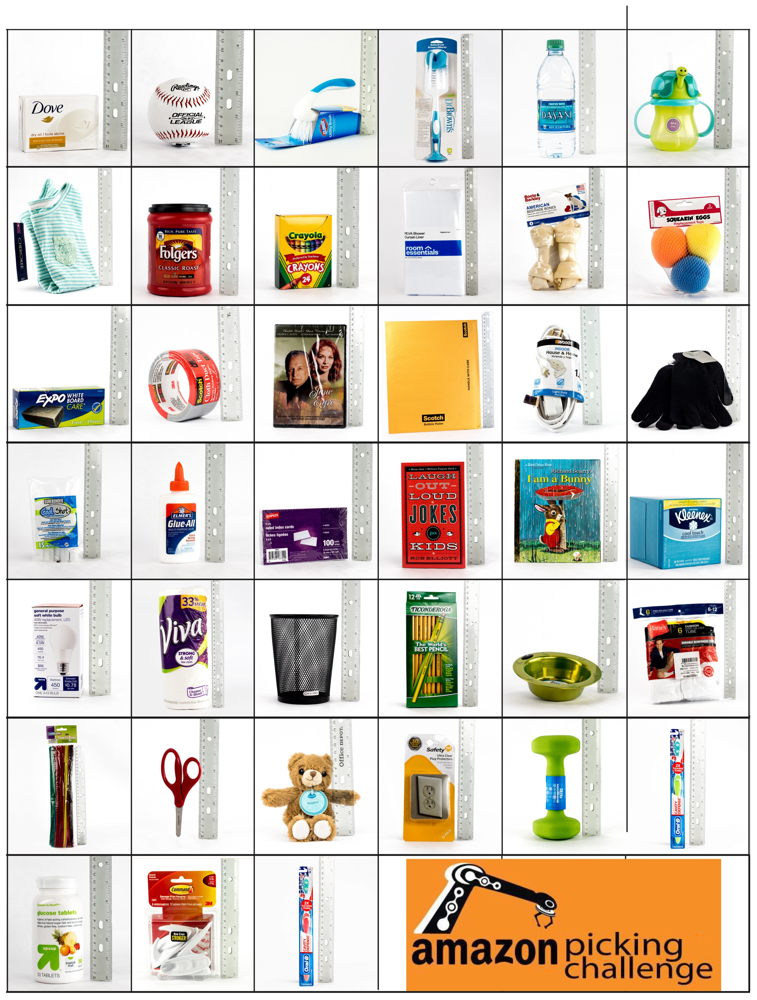
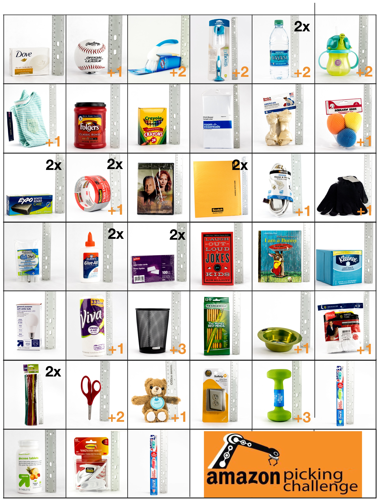
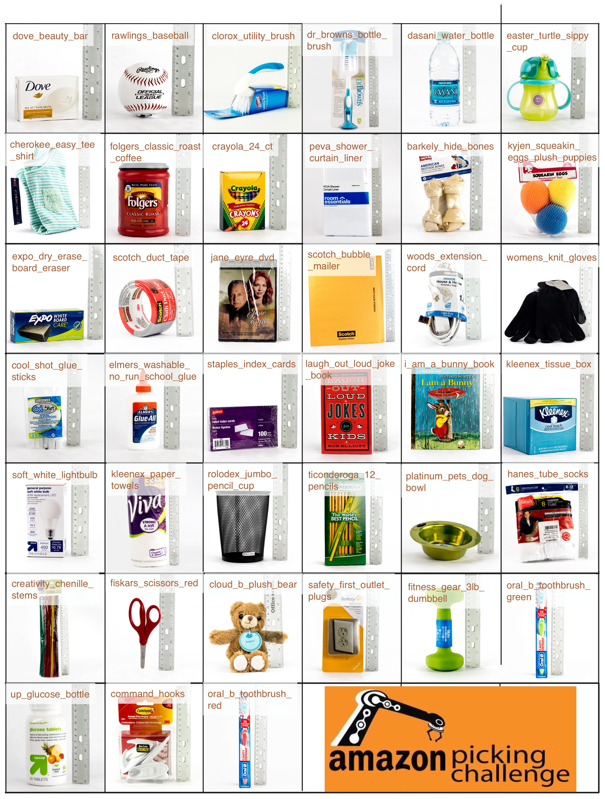

APC2016 rules
=============

Objects
-------

Bonus and Stocks
----------------

Scoring
-------

Pick Task
+++++++++

- Bins with 1 or 2 items

  - +10 points

- Bins with 3 or 4 items

  - +15 points

- Bins with 5 or more items

  - +20 points

Stow Task
+++++++++

- Bins that started with 1 or 2 items

  - +10 points

- Bins that started with 3 or 4 items

  - +15 points

- Bins that started with 5 or more items

  - +20 points

Penalties
---------

- For each item that is not in a bin, the tote, or actively held by the robot at the and of the attempt:

  - -10 points

- For each incorrect final position in the Task Output File for an item that is in a bin or the tote:

  - -10 points

- Minor damage to any item or the shelf:

  - -5 points

- Major damage to any item or the shelf:

  - -20 points

- Dropping an item from a height of more than 0.3 meters:

  - -5 points

- Leaving an item protruding out of its bin by more than 0.5cm:

  - -5 points

Names
-----

Pick Task
---------

Sample
++++++

- :download:`Interface Json<_media/apc2016_pick_layout_sample.json>`

- :download:`Layout View<_media/apc2016_pick_layout_sample.pdf>` 
  
- :download:`Output Json<_media/apc2016_pick_output_sample.json>`

Stow Task
---------

Sample
++++++

- :download:`Interface Json<_media/apc2016_stow_layout_sample.json>`
- :download:`Pod Layout View<_media/apc2016_stow_pod_layout_sample.jpeg>`
- :download:`Tote Layout View 1<_media/apc2016_stow_tote_layout_sample_1.jpg>`
- :download:`Tote Layout View 2<_media/apc2016_stow_tote_layout_sample_2.jpg>`
- :download:`Output Json<_media/apc2016_stow_output_sample.json>`
