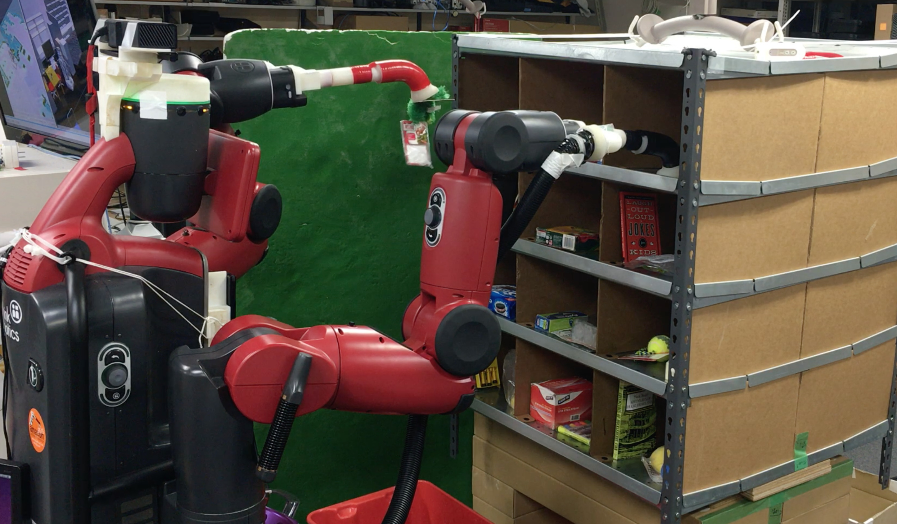

Demonstrate APC2015 on Real World
=================================

Real world demonstration for APC2015 can be done on ``baxter@sheeta.jsk.imi.i.u-tokyo.ac.jp``.

- Prepare json.
- Setup objects in Kiva.

.. code-block:: bash

  baxter@sheeta $ roscd jsk_apc && git checkout 0.2.2

  baxter@sheeta $ roslaunch jsk_2015_05_baxter_apc baxter.launch
  baxter@sheeta $ roslaunch jsk_2015_05_baxter_apc setup_torso.launch

  baxter@sheeta $ ssh doura
  baxter@doura $ tmux
  baxter@doura $ roscd jsk_apc && git checkout 0.2.2
  # on a tmux session
  baxter@doura $ sudo -s  # necessary for launch kinect2 with ssh login
  baxter@doura $ roslaunch jsk_2015_05_baxter_apc setup_head.launch
  # detach from the tmux session and logout from doura here

  baxter@sheeta $ roslaunch jsk_2015_05_baxter_apc main.launch json:=$(rospack find jsk_2015_05_baxter_apc)/json/layout_12.json

  # optional visualization
  $ rviz -d $(rospack find jsk_2015_05_baxter_apc)/rvizconfig/segmentation.rviz  # check object segmentation in each bin
  $ rviz -d $(rospack find jsk_2015_05_baxter_apc)/rvizconfig/real_demo.rviz  # visualization for demo

https://github.com/start-jsk/jsk_apc/blob/master/jsk_2015_05_baxter_apc/json/layout_12.json

.. image:: _images/setup_demo_1.jpg
   :width: 16%

.. image:: _images/real_world_rviz.jpg
   :width: 32%

.. image:: _images/apc2015_real_demo.png
   :alt: Amazon Picking Challenge 2015 Real World Demonstration
   :width: 40%
   :target: https://www.youtube.com/watch?v=G-A-sEThWAQ