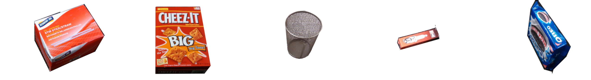

work_order.py
=============

What is this?
-------------

Publishes the picking order for each arm of Baxter robot in Amazon Picking Challenge 2015.

Rules
-----

1. It abandon bins whose target object is listed below:
  - genuine_joe_plastic_stir_sticks (big & heavy)
  - cheezit_big_original (big & heavy)
  - rolodex_jumbo_pencil_cup (many holes)
  - champion_copper_plus_spark_plug (small)
  - oreo_mega_stuf (heavy)

2. Left bins are assigned to left arm, vice versa.
3. Center bins are assigned to one arm (left or right).

Subscribing Topic
-----------------

None.

Publishing Topic
----------------

* ``~left_hand``, ``~right_hand`` (``jsk_2015_05_baxter_apc/WorkOrderArray``)

  Picking orders for each arm.

Parameters
----------

* ``~json`` (type: ``String``, required)

  Path of json file for the challenge.

Example
-------

.. code-block:: bash

  rosrun jsk_2015_05_baxter_apc work_order.py _json:=$(rospack find jsk_2015_05_baxter_apc)/json/apc2015_layout_1.json
