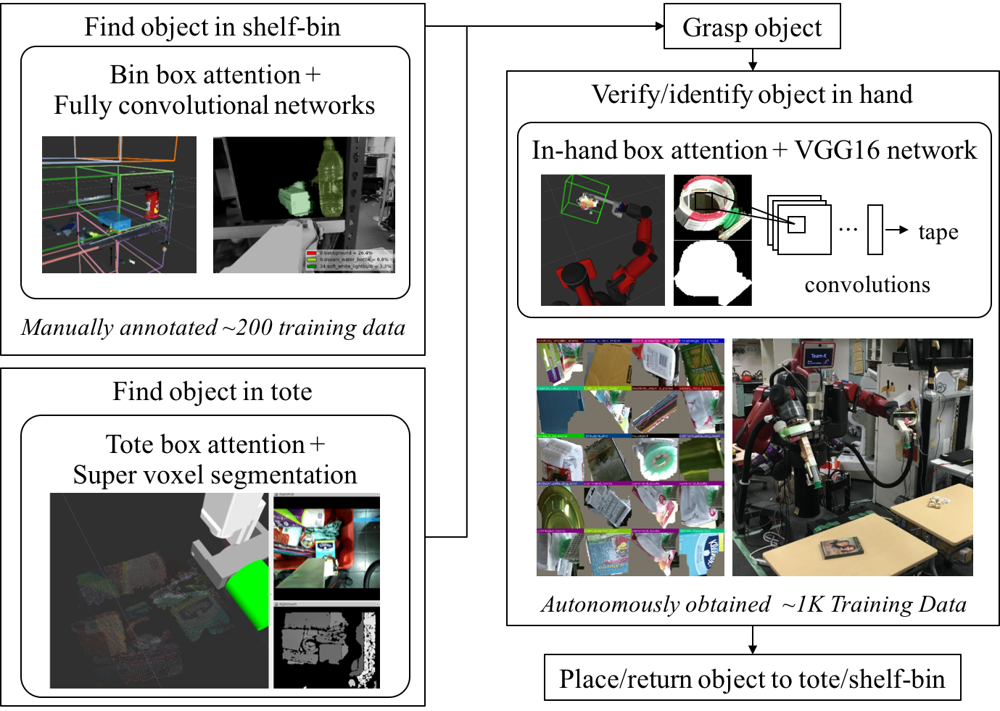

jsk_2016_01_baxter_apc
======================

**jsk_2016_01_baxter_apc** is ROS package for Amazon Picking Challenge in June 2016.

.. toctree::
   :maxdepth: 1
   :glob:

   apc2016_pick_trial
   apc2016_pick_trial_rgv5
   apc2016_stow_trial

Installation
------------

See `Installation <installation.html>`_.

System
------

- :download:`PDF version<_media/system.pdf>`

MasterPiece
-----------

Well-done Images and Videos

READ/WRITE: https://drive.google.com/drive/u/1/folders/0B5DV6gwLHtyJS2NKU3J4WXo2TDA 

Logs
----

.. toctree::
  :maxdepth: 1
  :glob:

  logs/*

Shared Files
------------

READ/WRITE: https://drive.google.com/drive/u/1/folders/0B9P1L--7Wd2vLXo1TGVYLVh3aE0

Google Drive folder is shared.
There are shared files like log files and datasets.

Testing
-------

.. code-block:: bash

  catkin run_tests jsk_2016_01_baxter_apc --no-deps
