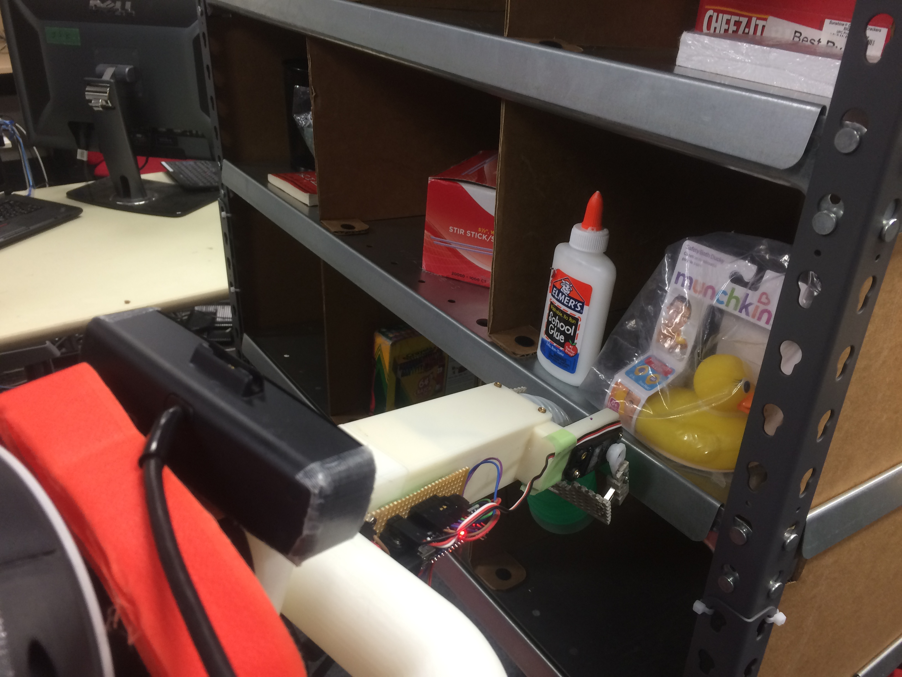
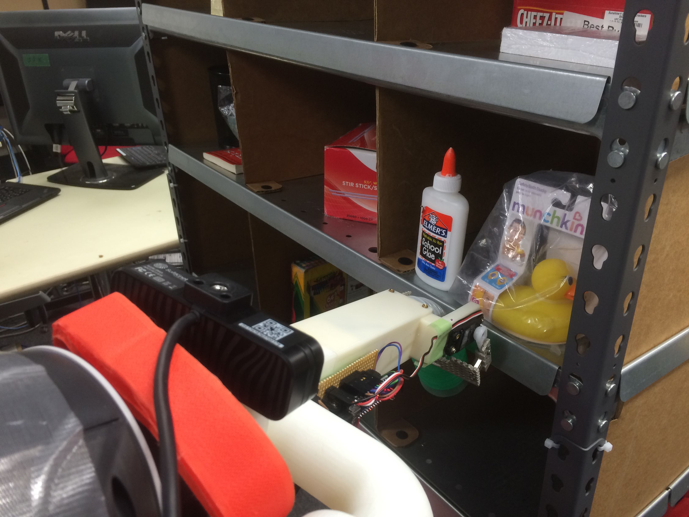
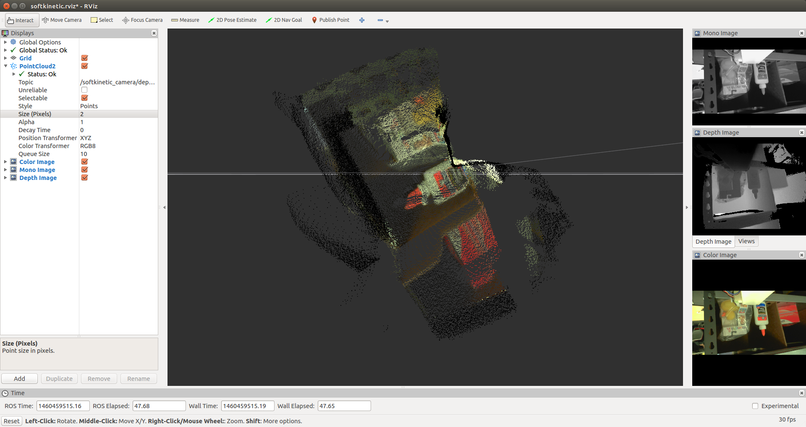

2016-04-12
==========

Evaluation of CREATIVE camera and DepthSense camera
---------------------------------
- compare CREATIVE camera and DepthSense camera

Conclusion
----------

*Almost same performance*

but DepthSense camera is a little bit weird

CREATIVE camera
---------------

Specs
----
- 15cm以上離れている必要あり

- depth image: `/softkinetic_camera/depth/image_raw`

  - height: 240
  - width: 320
  - encoding: 32FC1

- color image `/softkinetic_camera/rgb/image_color`

  - height: 720
  - width: 1280
  - encoding: bgr8

- points xyzrgb `/softkinetic_camera/depth/points`

  - height: 240
  - width: 320

Issues
------

Experiment
----------

*Setup*

*Topic hz*

Grid table:

+------------------------------------+--------+-----------+-----------+-------+
|topic                               |rate    |min_delta  |max_delta  |std_dev|
+====================================+========+===========+===========+=======+
|/softkinetic_camera/depth/points    |30.053  |0.021      |0.043      |0.005  |
+------------------------------------+--------+-----------+-----------+-------+
|/softkinetic_camera/depth/image_raw |30.136  |0.018      |0.044      |0.006  |
+------------------------------------+--------+-----------+-----------+-------+
|/softkinetic_camera/rgb/image_color |25.250  |0.058      |0.061      |0.008  |
+------------------------------------+--------+-----------+-----------+-------+

*View*

- front view
.. image:: _images/creative_front.png

- above view
 .. image:: _images/creative_above.png

DepthSense
----------

Specs
-----

- 15cm以上離れている必要がある

- points xyzrgb `/softkinetic_camera/depth/points`

  - height: 240
  - width: 320
  - encoding: 32FC1

- depth image `/softkinetic_camera/depth/image_raw`

  - height: 240
  - width: 320
  - encoding: 32FC1

- color image `/softkinetic_camera/rgb/image_color`

  - height: 720
  - width: 1280
  - encoding: bgr8

Issues
------

- color image `/softkinetic_camera/rgb/image_color` の色が全体的に黄色い

- a little bit noisy?

Experient
---------

*Setup*

*Topic hz*

Grid table:

+------------------------------------+--------+-----------+-----------+-------+
|topic                               |rate    |min_delta  |max_delta  |std_dev|
+====================================+========+===========+===========+=======+
|/softkinetic_camera/depth/points    |30.164  |0.017      |0.043      |0.006  |
+------------------------------------+--------+-----------+-----------+-------+
|/softkinetic_camera/depth/image_raw |30.136  |0.018      |0.045      |0.005  |
+------------------------------------+--------+-----------+-----------+-------+
|/softkinetic_camera/rgb/image_color |24.960  |0.032      |0.051      |0.005  |
+------------------------------------+--------+-----------+-----------+-------+

*View*

- front view

- above view
 .. image:: _images/depthsense_above.png

