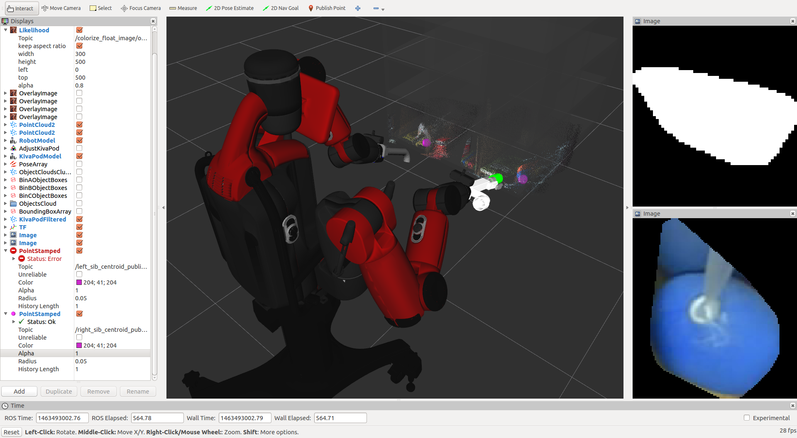

2016-05-17
==========

**Segmentation in bin with softkinetic camera**

What you did?
-------------

- resize output mask image 
- fix camera info
- add robot self filter
- get proper centroid position

Results
-------

What you think/feel?
--------------------

- it works good, i think :)

Log data
--------

- https://drive.google.com/file/d/0B5DV6gwLHtyJX2N3aHhGN0FMczg/view?usp=sharing
