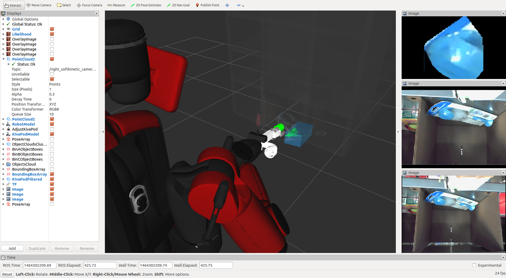

2016-05-27
==========

**Get Bounding Box from SIB**

What you did?
-------------

- Use ClusterPointIndicesDecomposer to get Bounding Box 

What is issue?
--------------

- gripper2016 use sign: 1 in case baxter tries to pick short object in bin k

  - `start-jsk/jsk_apc#1561 <https://github.com/start-jsk/jsk_apc/issues/1561>`_

What you think/feel?
--------------------

- segmentation really depends on object kind, of course. 

Video
--------

- https://drive.google.com/file/d/0B5DV6gwLHtyJWE9VdVlfU2liOWM/view?usp=sharing
