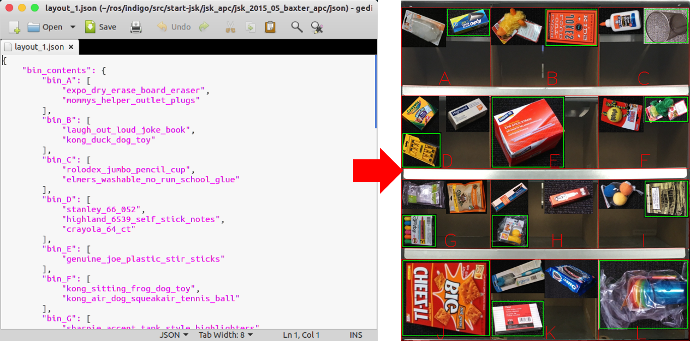

visualize_json.py
=================

What is this?
-------------

Visualizes json file which is the interface for Amazon Picking Challenge 2015.

Subscribing Topic
-----------------

None.

Publishing Topic
----------------

* ``~output`` (``sensor_msgs/Image``)

  Bin contents image.

Example
-------

.. code-block:: bash

  rosrun jsk_apc2015_common visualize_json.py $(rospack find jsk_2015_05_baxter_apc)/json/layout_1.json
  rosrun image_view image_view image:=/visualize_json/output
