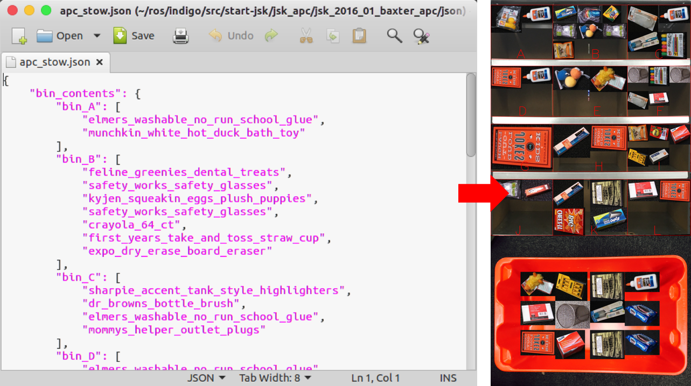

visualize_stow_json.py
======================

What is this?
-------------

Visualizes json file for *Stow Task* which is the interface for
Amazon Picking Challenge 2016.

Subscribing Topic
-----------------

None.

Publishing Topic
----------------

* ``~output`` (``sensor_msgs/Image``)

  Bin contents image.

Example
-------

.. code-block:: bash

  rosrun jsk_apc2016_common visualize_stow_json.py $(rospack find jsk_2016_01_baxter_apc)/json/apc_stow.json
  rosrun image_view image_view image:=/visualize_stow_json/output
