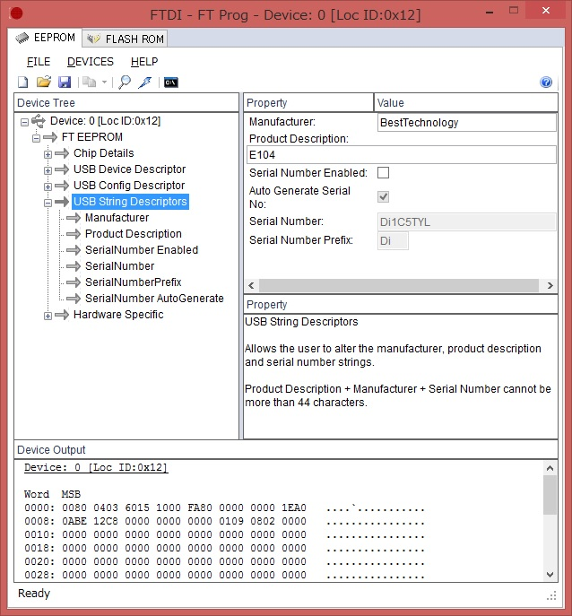
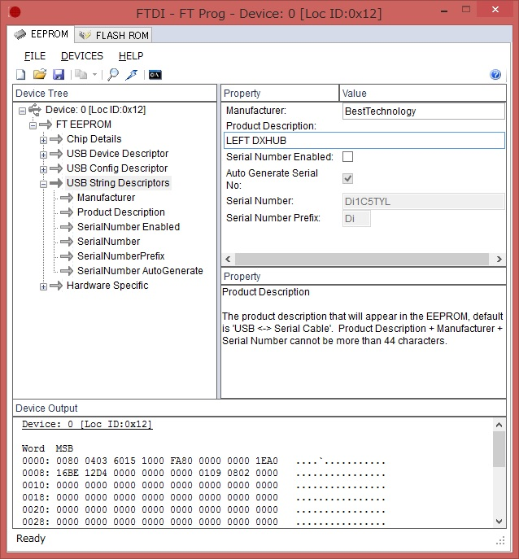
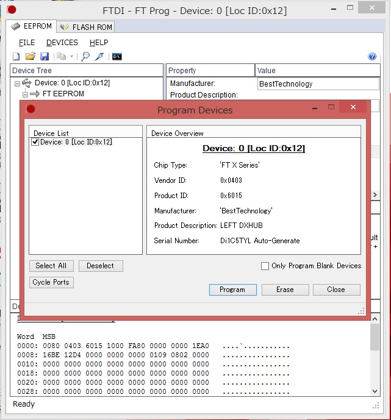

Gripper-v6 Setup
================

Adjust gravity compensation
---------------------------

Gripper-v6 is heavy (1.18kg), so we should adjust gravity compensation of Baxter.

For now (2017/6/17), ``roslaunch jsk_arc2017_baxter baxter.launch`` does it by:

.. code-block:: bash

  $ rostopic pub -1 /robot/end_effector/right_gripper/command baxter_core_msgs/EndEffectorCommand '{ id : 131073, command : "configure", args : "{ \"urdf\":{ \"name\": \"right_gripper_mass\", \"link\": [ { \"name\": \"right_gripper_mass\", \"inertial\": { \"mass\": { \"value\": 1.18 }, \"origin\": { \"xyz\": [0.0, 0.0, 0.15] } } } ] }}"}'

If you want to change gripper, you should restore to the original setting by:

.. code-block:: bash

  $ rostopic pub -1 /robot/end_effector/right_gripper/command baxter_core_msgs/EndEffectorCommand '{ id : 131073, command : "configure", args : "{ \"urdf\":{ \"name\": \"right_gripper_mass\", \"link\": [ { \"name\": \"right_gripper_mass\", \"inertial\": { \"mass\": { \"value\": 0 }, \"origin\": { \"xyz\": [0.0, 0.0, 0.0] } } } ] }}"}'

More information about gripper customization of Baxter is on `official page <http://sdk.rethinkrobotics.com/wiki/Gripper_Customization>`_

Distinguish left DXHUB from right one
-------------------------------------

Each left and right gripper has its own DXHUB for communication with motors.
To distinguish two DXHUBs and create correct symbolic links (``/dev/r_dxhub`` and ``/dev/l_dxhub``), you have to change the configuration of left DXHUB from default.
Because the configuration is inside EEPROM of FTDI chip on DXHUB, you have to write a new configuration to that EEPROM.

Method on Windows
^^^^^^^^^^^^^^^^^

You should use `FT_PROG <http://www.ftdichip.com/Support/Utilities.htm#FT_PROG>`_ to program EEPROM.
Please install it and take the following steps to change the configuration.

1. Connect DXHUB to PC with a USB cable. Don't connect other USB devices. Power supply to DXHUB is not needed
2. Wait until device driver installation is finished
3. Launch FT_PROG
4. Click the loupe icon to scan devices
5. Click the plus icon of "USB String Descriptors"

6. Change "Product description" value to the value of ``ATTRS{product}`` in `the udev rule <https://github.com/start-jsk/jsk_apc/blob/master/jsk_arc2017_baxter/udev/80-dxhub.rules#L3>`_

7. Click the lightning icon

8. Click "Program" to write the modified configuration to  EEPROM
