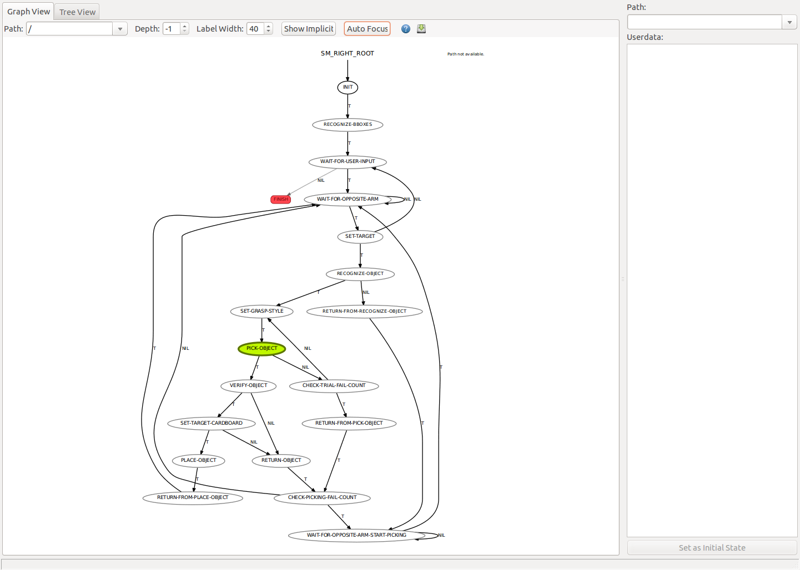
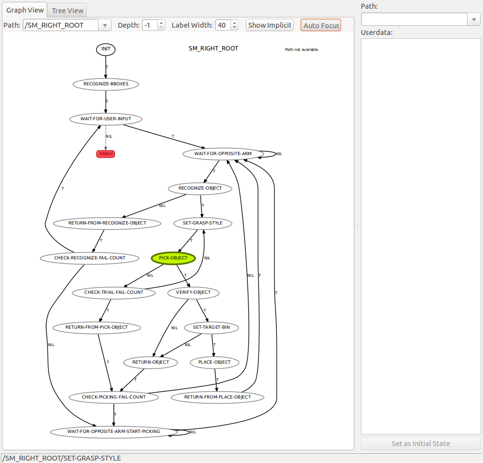

State Machine
=============

Task states are controlled by ``smach``.
You can check state machines by ``smach_viewer``.

Pick Task
---------

.. code-block:: bash

  # Run pick task with smach_viewer
  baxter@sheeta $ roslaunch jsk_arc2017_baxter pick.launch json_dir:=$(rospack find jsk_arc2017_common)/data/json/sample_pick_task smach_viewer:=true

Stow Task
---------

.. code-block:: bash

  # Run stow task with smach_viewer
  baxter@sheeta $ roslaunch jsk_arc2017_baxter stow.launch json_dir:=$(rospack find jsk_arc2017_common)/data/json/sample_stow_task smach_viewer:=true
