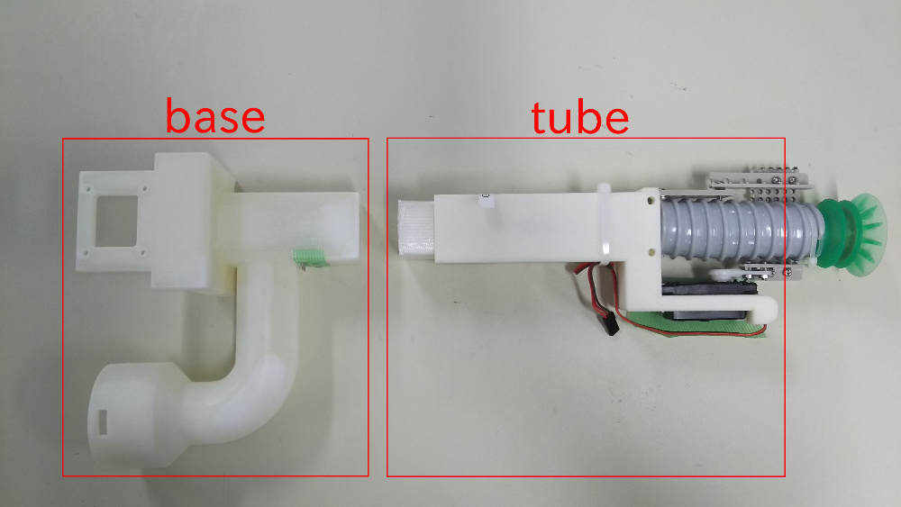
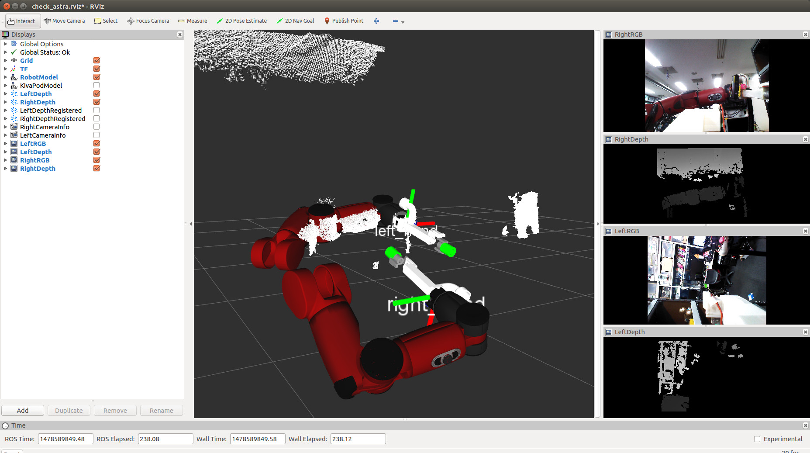

Tips & FAQ
==========

How to run rostests?
--------------------

.. code-block:: bash

  catkin run_tests --this --no-deps
  catkin run_tests jsk_arc2017_baxter --no-deps

How to run roslint?
-------------------

.. code-block:: bash

  catkin build --this --no-deps --catkin-make-args roslint --
  catkin build jsk_arc2017_baxter --no-deps --catkin-make-args roslint --

Controlling joints of the robot does not work.
----------------------------------------------
Run below to synchronize the time with robot.
Time synchronization is crucial.

.. code-block:: bash

  sudo ntpdate baxter.jsk.imi.i.u-tokyo.ac.jp

Rosdep failure due to cython version.
-------------------------------------
.. code-block:: bash

  rosdep install -y -r --from-paths . --ignore-src

This command may fail with below errors.

.. code-block:: bash

  pkg_resources.DistributionNotFound: cython>=0.21
  ...
  ERROR: the following rosdeps failed to install
  pip: command [sudo -H pip install -U scikit-image] failed
  pip: Failed to detect successful installation of [scikit-image]

In this case, maybe your setuptools is too old. Please run below command.

.. code-block:: bash

  sudo pip install -U setuptools

https://github.com/start-jsk/jsk_apc/issues/1244 for details.

How to release a new version of jsk_apc?
----------------------------------------
.. code-block:: bash

  roscd jsk_apc
  catkin_generate_change_log
  # edit CHANGELOG.rst to create a pretty changelog
  catkin_prepare_release
  bloom-release --rosdistro indigo --track indigo jsk_apc  # you may need to fix package.xml for pip packages

Error related to machine tag in roslaunch.
------------------------------------------

If you have error like below, check `here <http://answers.ros.org/question/41446/a-is-not-in-your-ssh-known_hosts-file/>`_.

.. code-block:: bash

  % roslaunch jsk_2016_01_baxter_apc setup_torso.launch
  ... logging to /home/baxter/.ros/log/44aa3fbe-23c6-11e6-b5c0-000af716d1cb/roslaunch-sheeta-74117.log
  Checking log directory for disk usage. This may take awhile.
  Press Ctrl-C to interrupt
  Done checking log file disk usage. Usage is <1GB.

  started roslaunch server http://133.11.216.190:36416/
  remote[133.11.216.167-0] starting roslaunch
  remote[133.11.216.167-0]: creating ssh connection to 133.11.216.167:22, user[baxter]
  remote[133.11.216.167-0]: failed to launch on doura:

  133.11.216.167 is not in your SSH known_hosts file.

  Please manually:
    ssh baxter@133.11.216.167

  then try roslaunching again.

  If you wish to configure roslaunch to automatically recognize unknown
  hosts, please set the environment variable ROSLAUNCH_SSH_UNKNOWN=1

Gripper used in APC2016
-----------------------

This gripper has two parts made by 3D printers. "base" part is made by ProJet and "tube" part is made by Dimension. 3D data of these parts are `here <https://github.com/pazeshun/jsk_apc_2016_meshes>`_. For now(2016/9/27), left gripper is gripper-v3 and right gripper is gripper-v4.

Also, PCB data of the control board on this gripper are `here <https://github.com/ban-masa/arm_manager_arduino>`_.

The servo motor used in this gripper is `GWS S11HP/2BBMG/JR <http://akizukidenshi.com/catalog/g/gM-01724/>`_.

How to calibrate extrinsic parameters of Astra
----------------------------------------------

.. code-block:: bash

  % roslaunch jsk_2016_01_baxter_apc baxter.launch
  % roscd jsk_2016_01_baxter_apc/rvizconfig
  % rviz -d check_astra.rviz
  % roslaunch jsk_2016_01_baxter_apc astra_hand.launch

You can see Rviz like below:

If you want to reverse right and left camera vision:

.. code-block:: bash

  % roslaunch jsk_2016_01_baxter_apc astra_hand.launch left_first:=false

If the point cloud and the robot model are too different in Rviz, you should change the pose of depth optical frame like below:

.. code-block:: bash

  % rosrun tf static_transform_publisher -0.10 -0.008 0.015 -1.56 0.00 -0.08 right_hand right_hand_camera_depth_optical_frame 100 __name:=right_hand_camera_depth_static_tf_publisher  # This is just an example

  # OR

  # % roslaunch jsk_2016_01_baxter_apc astra_hand.launch --args /right_hand_camera_depth_static_tf_publisher
  % /opt/ros/indigo/lib/tf/static_transform_publisher -0.10 -0.008 0.015 -1.56 0.00 -0.08 right_hand right_hand_camera_depth_optical_frame 100 __name:=right_hand_camera_depth_static_tf_publisher  # This is just an example

After you adjust point cloud, you should check color point cloud:

If the color point cloud and the robot model are too different in Rviz, you should change the pose of RGB optical frame like below:

.. code-block:: bash

  % rosrun tf static_transform_publisher 0.040 0.01 0 0.0 0 0 right_hand_camera_depth_optical_frame right_hand_camera_rgb_optical_frame 100 __name:=right_hand_camera_rgb_static_tf_publisher  # This is just an example

  # OR

  # % roslaunch jsk_2016_01_baxter_apc astra_hand.launch --args /right_hand_camera_rgb_static_tf_publisher
  % /opt/ros/indigo/lib/tf/static_transform_publisher 0.040 0.01 0 0.0 0 0 right_hand_camera_depth_optical_frame right_hand_camera_rgb_optical_frame 100 __name:=right_hand_camera_rgb_static_tf_publisher  # This is just an example
