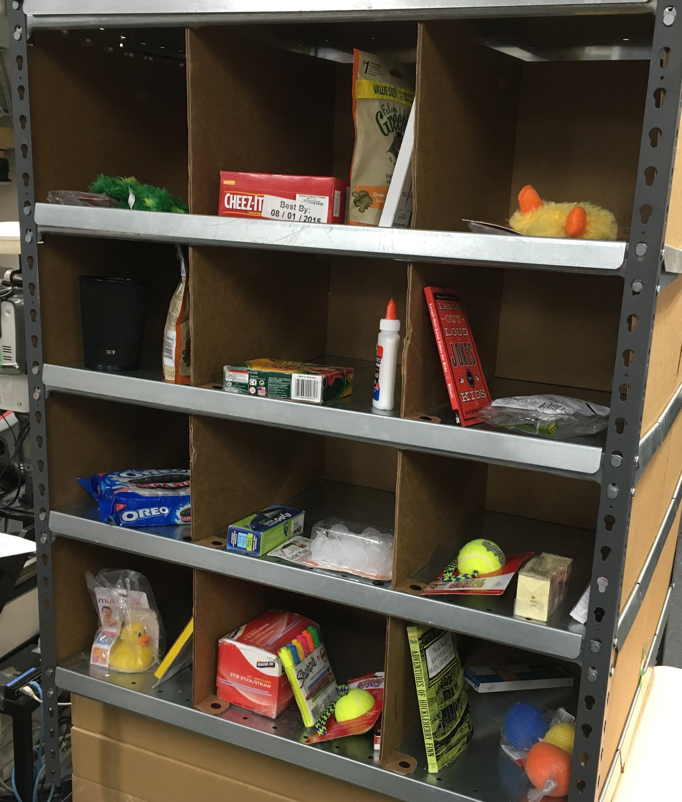
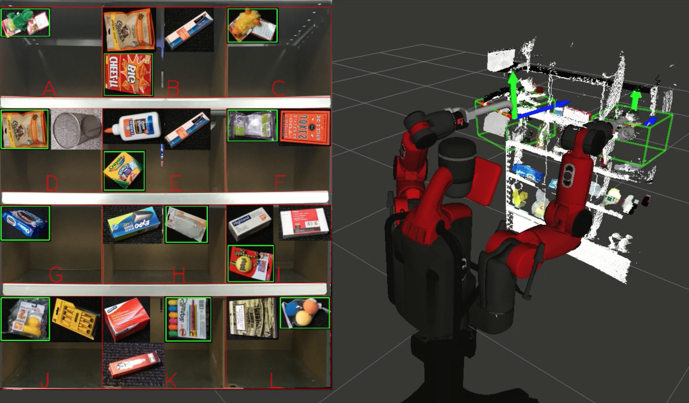
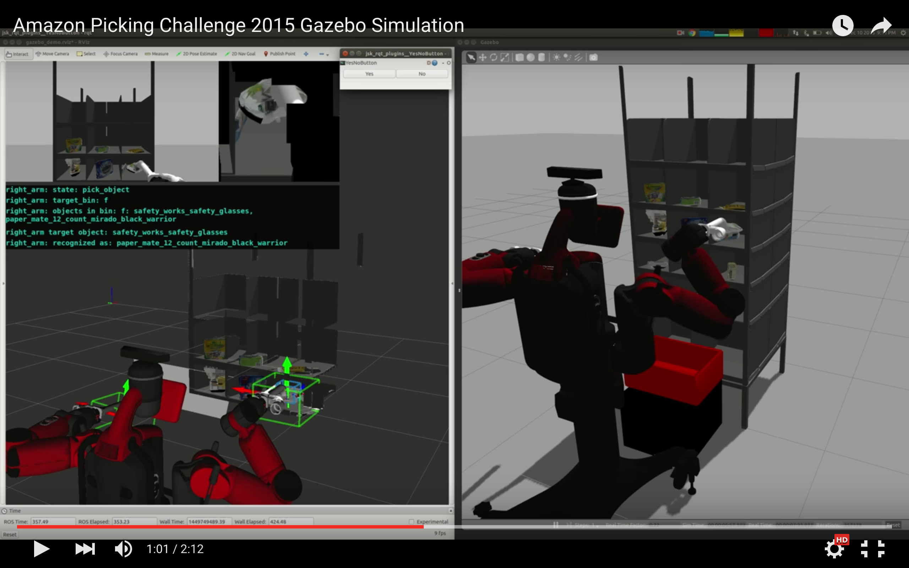

jsk_2015_05_baxter_apc
======================

Usage
-----

### Demonstration on Real World

Real world demonstration for APC2015 can be done on ``baxter@sheeta.jsk.imi.i.u-tokyo.ac.jp``.

- Prepare json.
- Setup objects in Kiva.

```bash

baxter@sheeta $ roslaunch jsk_2015_05_baxter_apc baxter.launch
baxter@sheeta $ roslaunch jsk_2015_05_baxter_apc setup.launch

baxter@sheeta $ ssh doura
baxter@doura $ tmux
# on a tmux session
baxter@doura $ sudo -s  # necessary for launch kinect2 with ssh login
baxter@doura $ roslaunch jsk_2015_05_baxter_apc doura.launch
# detach from the tmux session and logout from doura here

baxter@sheeta $ roslaunch jsk_2015_05_baxter_apc main.launch json:=$(rospack find jsk_2015_05_baxter_apc)/json/demo_1.json

# optional visualization
$ rviz -d $(rospack find jsk_2015_05_baxter_apc)/rvizconfig/segmentation.rviz  # check object segmentation in each bin
$ rviz -d $(rospack find jsk_2015_05_baxter_apc)/rvizconfig/real_demo.rviz  # visualization for demo

```

https://github.com/start-jsk/jsk_apc/blob/master/jsk_2015_05_baxter_apc/json/demo_1.json





<a href="https://www.youtube.com/watch?v=G-A-sEThWAQ">
  
</a>


### Demonstration on Simulation

Real world demonstration for APC2015 can be done on any computers with ROS indigo.

```bash

roslaunch jsk_2015_05_baxter_apc baxter_sim.launch kiva:=true
roslaunch jsk_2015_05_baxter_apc setup.launch
roslaunch jsk_2015_05_baxter_apc main.launch json:=$(rospack find jsk_apc2015_common)/json/f2.json

# optional visualization
rviz -d $(rospack find jsk_2015_05_baxter_apc)/rvizconfig/gazebo_demo.rviz  # visualization for demo

```

<a href="https://www.youtube.com/watch?v=uV6XctamwEA">
  
</a>


Shared Files
------------

READONLY: https://drive.google.com/drive/u/1/folders/0B9P1L--7Wd2vS1pjRENUMlFPYlU

Google Drive folder is shared.
There are shared files like log files and datasets.


Testing
-------

```bash

catkin run_tests jsk_2015_05_baxter_apc --no-deps

```
