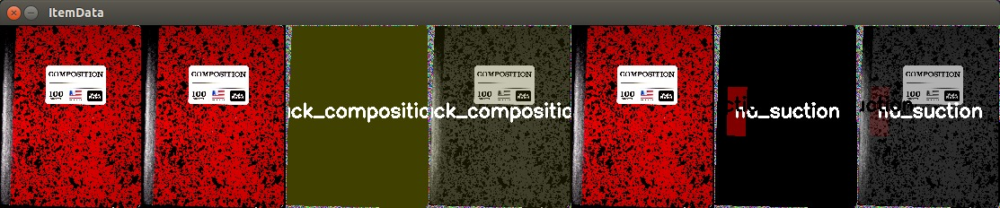
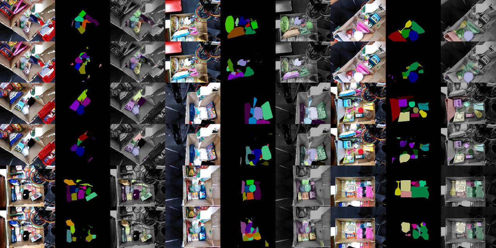

# fewshot_segmentation


## Installation

```bash
# install mvtk
# If you don't have an access, please request to @wkentaro.
git clone https://github.com/wkentaro/mvtk.git && cd mvtk
git checkout 58c34f1688d30283fb823158258d94839e7f40e9
./install.sh
cd ..

source activate mvtk/.anaconda2/bin/activate

# install data
./install_data.py
```


## Usage

Note that below commands assume the anaconda is already activated:

```bash
source activate mvtk/.anaconda2/bin/activate
```

### View *ItemData*

```bash
item_data_dir=~/data/arc2017/item_data/pick_re-experiment

cd mvtk/experiments/grasp_prediction_arc2017
./view_item_data.py $item_data_dir
```



### Few-shot training

```bash
cd mvtk/experiments/fcn_arc2017
ln -fs $item_data_dir item_data/cfg12
./train_fcn32s.py --config 13 --gpu 0
```

**Inference example (4000 iteration, ~15 min)**




## ROS integration

### Create system inputs

We need `object_graspability.yaml` and `object_weights.yaml`.

```bash
mvtk/experiments/fcn_arc2017/item_data_to_jsk_apc.py $item_data_dir

# Copy system inputs
ln -fs ${item_data_dir}_to_jsk_apc/*.yaml $(rospack find jsk_arc2017_common)/config/
ln -fs ${item_data_dir}_to_jsk_apc/*.npz $(rospack find jsk_arc2017_common)/data/models/fcn32s.npz
ln -fs ${item_data_dir}_to_jsk_apc/objects/* $(rospack find jsk_arc2017_common)/data/objects/
```

### Create JSON dir

```bash
json_dir=/tmp/test_json_dir
rosrun jsk_arc2017_common json_generator --dir $json_dir [--stow]
```

### Run task!

```bash
# pick task
roslaunch jsk_arc2017_baxter baxter.launch
roslaunch jsk_arc2017_baxter setup_for_pick.launch
roslaunch jsk_arc2017_baxter pick.launch json_dir:=$json_dir

# stow task
roslaunch jsk_arc2017_baxter baxter.launch
roslaunch jsk_arc2017_baxter setup_for_stow.launch
roslaunch jsk_arc2017_baxter stow.launch json_dir:=$json_dir
```
